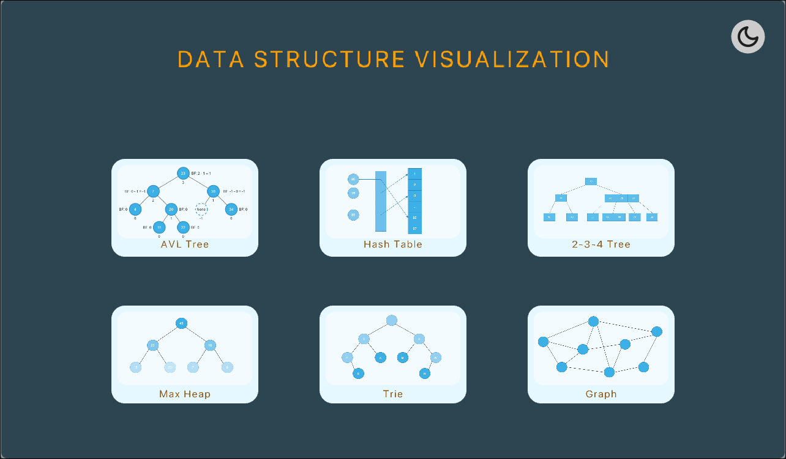

(There may be bugs :) Be careful!!!)
This project is a visualization tool for common data structures and algorithms, built using C++ and the Raylib library. It allows users to interactively observe how data structures change step-by-step during fundamental operations like insertion, deletion, and search.

## Table of Contents

*   [Features](#features)
*   [Supported Data Structures](#supported-data-structures)
*   [Tech Stack](#tech-stack)
*   [Directory Structure](#directory-structure)
*   [Getting Started](#getting-started)
    *   [Prerequisites](#prerequisites)
    *   [Building and Running](#building-and-running)
<!-- *   [How to Use](#how-to-use) -->
*   [Contributing](#contributing)
*   [Author](#author)

## Features

*   **Step-by-Step Visualization:** Detailed tracing of algorithm execution on data structures.
*   **User Interaction:** Allows users to input data, select operations (insert, delete, search, randomize, load from file).
*   **Animation Control:** Play, pause, step forward/backward, jump to start/end, and adjust animation speed.
*   **Pseudocode Display:** Shows corresponding pseudocode snippets for the current step for easy reference (not compeletely).
*   **User-Friendly Interface:** Simple and intuitive GUI created with Raylib.
*   **Cross-Platform (thanks to Raylib):** Capable of being compiled and run on multiple operating systems.

## Supported Data Structures

The project currently supports visualization for the following data structures:

*   **AVL Tree**
*   **Hash Table (Linear Probing)**
*   **2-3-4 Tree**
*   **Max Heap**
*   **Trie (Prefix Tree)**
*   **Graph**: Includes algorithms like finding connected components and Minimum Spanning Tree (MST - Kruskal).

## Tech Stack

*   **Programming Language:** C++
*   **Graphics and Multimedia Library:** [Raylib](https://www.raylib.com/)
*   **File Dialog Library:** [Portable File Dialogs](https://github.com/samhocevar/portable-file-dialogs)
*   **Build System:** GCC/G++ (via Makefile)

## Directory Structure
```
data-structures-visualization/
├── assets/
│   ├── demo/
│   ├── fonts/
│   └── images/
├── build/ 
│   ├── bin/
│   └── obj/
├── external/             
│   ├── portable-file-dialogs.h
│   ├── raylib.h
│   ├── raymath.h
│   └── rlgl.h
├── include/
│   ├── core/
│   │   ├── Application.h
│   │   ├── General.h
│   │   └── Menu.h
│   ├── datastructures/
│   │   ├── AVL.h
│   │   ├── Graph.h
│   │   ├── HashTable.h
│   │   ├── MaxHeap.h
│   │   ├── Tree234.h
│   │   └── Trie.h
│   ├── gui/
│   │   ├── Button.h
│   │   ├── CircleButton.h
│   │   ├── ImageButton.h
│   │   ├── InputStr.h
│   │   ├── ProgressBar.h
│   │   ├── TitleButton.h
│   │   └── Util.h
│   └── visualization/
│       ├── AVLTreeVisualize.h
│       ├── GraphVisualize.h
│       ├── HashTableVisualize.h
│       ├── MaxHeapVisualize.h
│       ├── Tree234Visualize.h
│       └── TrieVisualize.h
├── lib/                  
│   ├── Linux/
│       └── libraylib.a
│   ├── MacOS/
│       └── libraylib.dylib
│   ├── Web/                # For later updating
│       └── libraylib.a
│   └── Window/
│       └── libraylib.a
├── sampleData/           # Sample data for test
├── src/                  
│   ├── core/
│   │   ├── Application.h
│   │   ├── General.h
│   │   └── Menu.h
│   ├── datastructures/
│   │   ├── AVL.h
│   │   ├── Graph.h
│   │   ├── HashTable.h
│   │   ├── MaxHeap.h
│   │   ├── Tree234.h
│   │   └── Trie.h
│   ├── gui/
│   │   ├── Button.h
│   │   ├── CircleButton.h
│   │   ├── ImageButton.h
│   │   ├── InputStr.h
│   │   ├── ProgressBar.h
│   │   ├── TitleButton.h
│   │   └── Util.h
│   ├── visualization/
│   |   ├── AVLTreeVisualize.h
│   |   ├── GraphVisualize.h
│   |   ├── HashTableVisualize.h
│   |   ├── MaxHeapVisualize.h
│   |   ├── Tree234Visualize.h
│   |   └── TrieVisualize.h
│   └── main.cpp          
├── Makefile
└── README.md
```
## Getting Started (for linux)

### Prerequisites

*   **C++ Compiler:** GCC/G++ (recommended) or Clang.
*   **Make:** Build automation tool.
*   **(Linux)** Necessary libraries for Raylib (typically `libgl1-mesa-dev`, `libglu1-mesa-dev`, `libx11-dev`, `libxrandr-dev`, `libxi-dev`, `libxcursor-dev`, `libxinerama-dev`, `libasound2-dev`).
    ```bash
    # Example on Ubuntu/Debian
    sudo apt update
    sudo apt install build-essential libgl1-mesa-dev libglu1-mesa-dev libx11-dev libxrandr-dev libxi-dev libxcursor-dev libxinerama-dev libasound2-dev
    ```

### Building and Running

1.  **Clone the repository (if applicable):**
    ```bash
    git clone https://github.com/NgTrongDoanh/data-structures-visualization.git
    cd data-structures-visualization
    ```
2.  **Build the project:**
    Use the provided Makefile. Open a terminal in the project's root directory and run:
    ```bash
    make
    ```
    This will compile the source code and create an executable in the `build/bin/` directory. The default executable name is usually `ds_visualizer`.

3.  **Run the program:**
    ```bash
    make run
    ```
    (Or `./build/bin/ds_visualizer`)

<!--
## How to Use

1.  **Main Menu Screen:**
    *   Select a data structure from the menu to start its visualization.
    *   A Light/Dark mode toggle button is available in the top-right corner.

2.  **Visualization Screen:**
    *   **Left Sidebar:**
        *   **Code Area:** Displays pseudocode or key steps of the algorithm being executed. The current line is highlighted.
        *   **Information Panel:** Provides descriptive information about the current step or the result of an operation.
        *   **Actions Panel:**
            *   **Create:** Allows creating a new data structure (either randomized or loaded from a file).
            *   **Insert, Delete, Search:** Buttons to perform the respective operations. Enter a value in the input field and press the adjacent "Play" button.
            *   **(Structure-Specific):** May include unique function buttons like "Resize" (HashTable), "Component", "MST" (Graph), "Top", "Size" (MaxHeap).
        *   **Progress Bar & Controls:**
            *   Slider shows the progress of the animation sequence.
            *   `<<` (Double Back): Rewind to the first step.
            *   `<` (Back): Step backward.
            *   `Play/Pause/Replay`: Play, pause, or replay the current animation sequence from the beginning.
            *   `>` (Next): Step forward.
            *   `>>` (Double Next): Fast-forward to the last step.
            *   `^` (Speed Up): Increase animation speed.
            *   `v` (Speed Down): Decrease animation speed.
            *   Displays current speed multiplier (e.g., `1.0x`).
    *   **Main Visualization Area (Center):** Displays the data structure and its changes. Key nodes/elements in the current step are highlighted.
    *   **Back Button (Left arrow at the top):** Returns to the main menu screen.
    *   **Title:** Shows the name of the data structure being visualized.
-->

## Contributing

Contributions are welcome! If you'd like to contribute to this project, please:

1.  Fork the repository.
2.  Create a new branch (`git checkout -b feature/AmazingFeature`).
3.  Commit your changes (`git commit -m 'Add some AmazingFeature'`).
4.  Push to the branch (`git push origin feature/AmazingFeature`).
5.  Open a Pull Request.

Any contributions, big or small, are greatly appreciated!

## Author

*   **TrDoanh** - *[VNUHCM - University of Science]*
